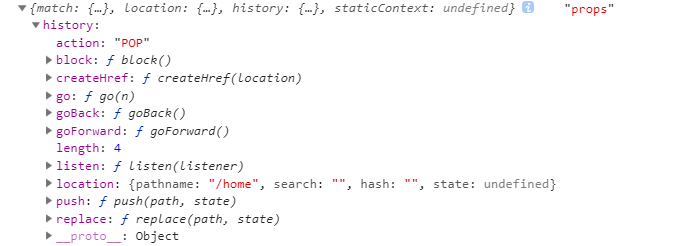
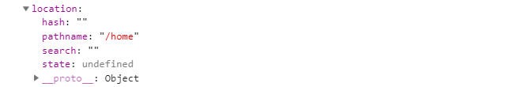
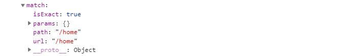

## 路由作用

用`react + router-touer(v4)`可以创建单页应用。
可以将组件映射到路由上，将对应的组件渲染到想要渲染的位置。

`react`路由的两种方式：
1. `HashRouter`: 利用`hash`实现路由的切换。
2. `BrowserRouter`: 利用`h5 Api`实现路由的切换。

根据路径的变化重新渲染组件。


## react-router-dom用法

`react-router-dom`基本用法

```typescript
import React, { Component } from 'react'
import { render } from 'react-dom'
import { HashRouter as Router, Route } from 'react-router-dom'

import Home from './views/Home/index'
import Profile from './views/Profile/index'
import User from './views/User/index'

export default class App extends Component {
  constructor (props: {}) {
    super(props)
  }
  public render () {
    return (
      <Router>
        <div>
          <Route path="/home" component={Home} />
          <Route path="/profile" component={Profile} />
          <Route path="/user" component={User} />
        </div>
      </Router>
    )
  }
}

render(<App />, document.querySelector('#root'))
```

> Route传递的参数

与`<Route />`组件相关：
- history
- location, 中的`pathname`最为重要，根据`pathname`变化组件
- match
- staticContext





> react跨组件传递消息

使用api:`React.createContext({}) // react16.3新增`

```typescript
import React, { Component } from 'react'

let { Provider, Consumer } = React.createContext({}) // react16.3新增

// Provider 提供数据
// Consumer 消费数据

export { Provider, Consumer }
```

父组件:
```typescript
public render () {
    return (
        <Provider value={{a: 1}}>
        { this.props.children } 
        {/* 获取子组件里内容 */}
        </Provider>
    )
}
```
子组件：
```typescript
public render () {
    return (
        <Consumer>
        {state => {
            global.console.log(state, 'state')
            return null
        }}
        </Consumer>
    )
}
```

